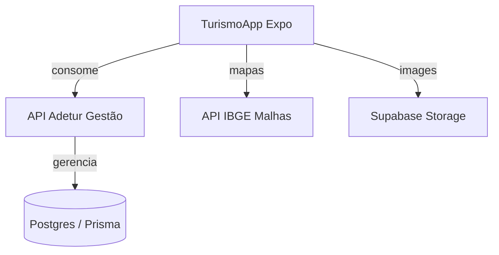

# Documentação Técnica: TurismoApp (Mobile)

## 1. Visão Geral

O **TurismoApp** é um aplicativo mobile desenvolvido para a ADETUR (Cataratas e Caminhos), focado em fornecer informações turísticas da região. O app serve como um guia digital para turistas, permitindo a exploração de municípios, pontos turísticos (destaques), eventos e trilhas/rotas.

---

## 2. Arquitetura do Sistema

O aplicativo é construído utilizando **React Native** com o ecossistema **Expo**, adotando o **Expo Router** para navegação baseada em arquivos.

### 2.1. Stack Tecnológica

- **Framework**: Expo (SDK 54)
- **Linguagem**: TypeScript
- **Navegação**: Expo Router (File-based routing)
- **Mapas**: `react-native-maps` + Integração com IBGE (GeoJSON)
- **Estilização**: Componentes customizados com suporte a Temas (Light/Dark mode)
- **Animações**: `react-native-reanimated`
- **Requisições**: Fetch API integrada com Hooks customizados

### 2.2. Fluxo de Dados e Integrações
O aplicativo funciona como um cliente (Frontend Mobile) que consome dados de um backend centralizado.

---

## 3. Funcionalidades Principais

### 3.1. Guia de Municípios

- **Listagem Dinâmica**: Lista de todos os municípios que compõem a região da ADETUR.
- **Filtro de Busca**: Pesquisa em tempo real por nome do município.
- **Detalhes do Município**: Informações históricas, demográficas e geográficas (Código IBGE, Prefeito, etc.).
- **Galeria de Fotos**: Visualização de fotos oficiais e brasão do município.

### 3.2. Destaques Turísticos (Highlights)

- **Exploração de Atrativos**: Visualização de pontos de interesse com descrições detalhadas.
- **Geolocalização**: Exibição da localização exata dos atrativos no mapa.
- **Galeria de Imagens**: Carrossel de fotos do ponto turístico.

### 3.3. Eventos e Calendário

- **Agenda Regional**: Listagem de eventos culturais, esportivos e festivos da região.
- **Detalhes do Evento**: Data, descrição, localização e imagens relacionadas.

### 3.4. Exploração e Localização

- **Mapa Satelital**: Integração com `react-native-maps` exibindo a posição em tempo real do usuário via GPS.
- **Cálculo de Proximidade**: Implementação da fórmula de Haversine para determinar a distância entre o usuário e os municípios da região.
- **Seção "Perto de Você"**: Listagem inteligente dos municípios mais próximos da localização atual.
- **Sugestões Aleatórias**: Carrossel dinâmico (com rolagem automática) de pontos turísticos para incentivar a descoberta.
- **Visualizador de Imagens**: Suporte para zoom e visualização em tela cheia de fotos das atrações.

---

## 4. Ecossistema de Micro-serviços

O aplicativo mobile é o frontend voltado ao cidadão/turista de um ecossistema mais amplo:

1. **Adetur Gestão (Dashboard & API)**:
    - Interface administrativa para gestores municipais.
    - API REST que alimenta o aplicativo mobile.
    - Gerenciamento de autenticação via Clerk e banco PostgreSQL (Prisma).
    - Processamento de imagens (Sharp) e armazenamento (Supabase).

2. **Adetur IGR (Portal Regional)**:
    - Portal institucional e de informações da Instância de Governança Regional.

---

## 5. Estrutura de Pastas e Padrões

- `app/`: Contém as rotas da aplicação (Expo Router).
  - `(tabs)/`: Navegação principal por abas (Início, Eventos, Trilhas).
  - `cities/[slug].tsx`: Detalhes dinâmicos de municípios.
  - `highlights/[id].tsx`: Detalhes dinâmicos de pontos turísticos.
- `components/`: Componentes modulares e reutilizáveis.
  - `municipio/`: Lógica de listagem e mapas de municípios.
  - `theme/`: Componentes primitivos com suporte a temas.
- `hooks/`: Camada de lógica e fetching (Ex: `useMunicipalities`, `useEvents`).
- `constants/`: Definições de cores, temas e configurações globais.
- `types/`: Definições de interfaces TypeScript para o contrato com a API.

---

## 6. Guia de Desenvolvimento

### 6.1. Comandos Principais

- `npx expo start`: Inicia o servidor de desenvolvimento.
- `npx expo run:android`: Executa o app no emulador Android.
- `npx expo run:ios`: Executa o app no simulador iOS.

### 6.2. Variáveis de Ambiente (.env)

O app utiliza a variável `EXPO_PUBLIC_API_URL` para definir o endereço do backend (Adetur Gestão).
